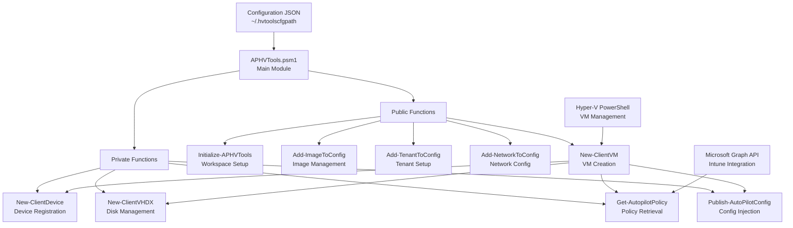
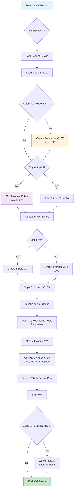
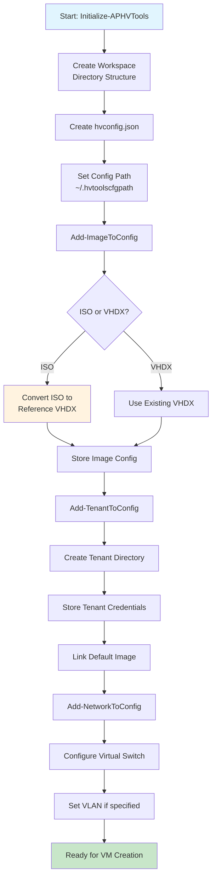
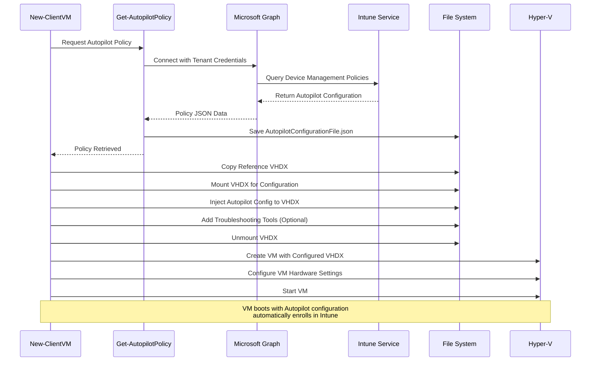

# APHVTools

[](https://github.com/PowerShell/PowerShell)
[](LICENSE)

A PowerShell module for automating the creation and management of Intune-managed virtual machines in Hyper-V. APHVTools streamlines the process of creating test/development VMs that are pre-configured for Windows Autopilot enrollment.

## Features

- 🚀 **Automated VM Creation**: Create multiple VMs with a single command
- 🏢 **Multi-Tenant Support**: Manage VMs for different organizations
- 💾 **Windows Image Management**: Handle ISO images and reference VHDX files
- 🔧 **Autopilot Integration**: Automatically fetch and inject Autopilot configuration
- 🌐 **Network Configuration**: Configure virtual networks and VLAN settings
- 🛠️ **Troubleshooting Tools**: Option to include diagnostic tools in VMs
- 📊 **Bulk Operations**: Create and manage multiple VMs efficiently

## Architecture Overview

APHVTools follows a modular PowerShell architecture with clear separation of concerns:



### Key Components

- **Configuration Management**: JSON-based configuration stored in user profile
- **Module Loading**: Dynamic loading of Public/Private functions
- **Multi-Tenant Support**: Isolated tenant configurations and VM storage
- **Autopilot Integration**: Microsoft Graph API integration for device policies
- **Image Management**: Reference VHDX creation and ISO handling

## Workflow Diagrams

### VM Creation Workflow



### Configuration Setup Workflow



### Autopilot Integration Flow



## Table of Contents

- [Architecture Overview](#architecture-overview)
- [Workflow Diagrams](#workflow-diagrams)
- [Requirements](#requirements)
- [Installation](#installation)
- [Quick Start](#quick-start)
- [Usage](#usage)
  - [Initialize Workspace](#initialize-workspace)
  - [Add Windows Images](#add-windows-images)
  - [Configure Tenants](#configure-tenants)
  - [Setup Networking](#setup-networking)
  - [Create Virtual Machines](#create-virtual-machines)
- [Advanced Usage](#advanced-usage)
- [Configuration](#configuration)
- [Troubleshooting](#troubleshooting)
- [Contributing](#contributing)
- [License](#license)
- [Acknowledgments](#acknowledgments)

## Requirements

### System Requirements
- Windows 10/11 Pro, Enterprise, or Education (with Hyper-V support)
- Windows Server 2016/2019/2022
- PowerShell 5.1 or higher
- Hyper-V role enabled
- At least 16GB RAM (recommended: 32GB+ for multiple VMs)
- Sufficient disk space for VMs (50GB+ per VM recommended)

### Required PowerShell Modules
The following modules will be automatically installed if missing:
- `Microsoft.Graph.Authentication` (v2.0.0+)
- `Microsoft.Graph.DeviceManagement` (v2.0.0+)
- `Microsoft.Graph.DeviceManagement.Enrollment` (v2.0.0+)
- `Hyper-ConvertImage` (v10.2+)
- `WindowsAutoPilotIntune` (v4.3+)
- `Microsoft.Graph.Intune` (v6.1907.1.0+)

### Permissions Required
- Local administrator rights
- Hyper-V administrator permissions
- Microsoft Intune administrator role (for Autopilot configuration)

## Installation

### From PowerShell Gallery (Recommended)

```powershell
# Install for current user
Install-Module -Name APHVTools -Scope CurrentUser

# Or install for all users (requires admin rights)
Install-Module -Name APHVTools -Scope AllUsers
```

### From Source

```powershell
# Clone the repository
git clone https://github.com/adamgell/HVTools.git
cd HVTools

# Build and import the module
./build.ps1 -modulePath ./APHVTools -buildLocal
Import-Module ./APHVTools/APHVTools.psd1 -Force
```

## Quick Start

```powershell
# 1. Import the module
Import-Module APHVTools

# 2. Initialize workspace
Initialize-APHVTools -Path "C:\APHVTools-Workspace"

# 3. Add a Windows image
Add-ImageToConfig -ImageName "Win11-23H2" -IsoPath "C:\ISOs\Windows11_23H2.iso"

# 4. Add a tenant
Add-TenantToConfig -TenantName "Contoso" -AdminUpn "admin@contoso.com" -ImageName "Win11-23H2"

# 5. Configure network
Add-NetworkToConfig -VSwitchName "Default Switch"

# 6. Create VMs
New-ClientVM -TenantName "Contoso" -NumberOfVMs 5 -CPUsPerVM 2 -VMMemory 4GB
```

## Usage

### Initialize Workspace

Before using APHVTools, initialize a workspace where VMs and configurations will be stored:

```powershell
Initialize-APHVTools -Path "C:\APHVTools-Workspace"
```

This creates the necessary folder structure and configuration files.

### Add Windows Images

Add Windows ISO images to your environment:

```powershell
# Add Windows 11 ISO
Add-ImageToConfig -ImageName "Win11-23H2" -IsoPath "C:\ISOs\Windows11_23H2.iso"

# Add Windows 10 ISO
Add-ImageToConfig -ImageName "Win10-22H2" -IsoPath "C:\ISOs\Windows10_22H2.iso"

# Add existing reference VHDX
Add-ImageToConfig -ImageName "Win11-Custom" -ReferenceVHDX "C:\VHDXs\Win11-Reference.vhdx"
```

During ISO import, you'll be prompted to select the Windows edition (Pro, Enterprise, Education).

### Configure Tenants

Add tenant configurations for different organizations:

```powershell
# Add a tenant with default image
Add-TenantToConfig -TenantName "Contoso" -AdminUpn "admin@contoso.com" -ImageName "Win11-23H2"

# Add another tenant
Add-TenantToConfig -TenantName "Fabrikam" -AdminUpn "admin@fabrikam.com" -ImageName "Win10-22H2"

# View all configured tenants
Get-APHVToolsConfig | Select-Object -ExpandProperty tenantConfig
```

### Setup Networking

Configure virtual network settings:

```powershell
# Use existing virtual switch
Add-NetworkToConfig -VSwitchName "Default Switch"

# Configure with VLAN
Add-NetworkToConfig -VSwitchName "External Switch" -VlanId 100
```

### Create Virtual Machines

Create VMs with various configurations:

```powershell
# Create 5 standard VMs
New-ClientVM -TenantName "Contoso" -NumberOfVMs 5 -CPUsPerVM 2 -VMMemory 4GB

# Create VMs with specific OS build
New-ClientVM -TenantName "Contoso" -OSBuild "Win11-23H2" -NumberOfVMs 3 -CPUsPerVM 4 -VMMemory 8GB

# Create VMs without Autopilot
New-ClientVM -TenantName "Fabrikam" -NumberOfVMs 2 -CPUsPerVM 2 -VMMemory 4GB -SkipAutoPilot

# Create VMs with troubleshooting tools
New-ClientVM -TenantName "Contoso" -NumberOfVMs 1 -CPUsPerVM 2 -VMMemory 4GB -IncludeTools
```

## Advanced Usage

### Adding Troubleshooting Tools

Include diagnostic tools in your VMs:

```powershell
# Add tools to configuration
Add-ToolsToConfig -ToolsPath "C:\DiagTools"

# Get configured tools
Get-ToolsFromConfig

# Create VM with tools included
New-ClientVM -TenantName "Contoso" -NumberOfVMs 1 -CPUsPerVM 2 -VMMemory 4GB -IncludeTools
```

### Working with Multiple Windows Editions

Create different reference images from the same ISO:

```powershell
# Add multiple editions from same ISO
Add-ImageToConfig -ImageName "Win11-Pro" -IsoPath "C:\ISOs\Windows11.iso"
Add-ImageToConfig -ImageName "Win11-Enterprise" -IsoPath "C:\ISOs\Windows11.iso"
Add-ImageToConfig -ImageName "Win11-Education" -IsoPath "C:\ISOs\Windows11.iso"
```

### Bulk Operations

Create large numbers of VMs efficiently:

```powershell
# Create 50 VMs in batches
1..5 | ForEach-Object {
    New-ClientVM -TenantName "Contoso" -NumberOfVMs 10 -CPUsPerVM 2 -VMMemory 4GB
    Start-Sleep -Seconds 30  # Pause between batches
}
```

### Using WhatIf

Test commands before execution:

```powershell
# Preview VM creation
New-ClientVM -TenantName "Contoso" -NumberOfVMs 5 -CPUsPerVM 2 -VMMemory 4GB -WhatIf

# Preview configuration changes
Add-TenantToConfig -TenantName "Test" -AdminUpn "admin@test.com" -ImageName "Win11-23H2" -WhatIf
```

## Configuration

### Configuration File Location

APHVTools stores its configuration at: `$env:USERPROFILE\.hvtoolscfgpath`

### Configuration Structure

```json
{
  "vmPath": "C:\\APHVTools-Workspace\\VMs",
  "referenceVHDXPath": "C:\\APHVTools-Workspace\\ReferenceVHDX",
  "tenantConfig": [
    {
      "tenantName": "Contoso",
      "adminUpn": "admin@contoso.com",
      "imageName": "Win11-23H2",
      "pathToConfig": "C:\\APHVTools-Workspace\\Contoso"
    }
  ],
  "networkConfig": {
    "vSwitchName": "Default Switch",
    "vlanId": null
  },
  "images": [
    {
      "imageName": "Win11-23H2",
      "imagePath": "C:\\ISOs\\Windows11_23H2.iso",
      "imageIndex": 3,
      "refVHDX": "C:\\APHVTools-Workspace\\ReferenceVHDX\\Win11-23H2.vhdx"
    }
  ]
}
```

### Viewing Configuration

```powershell
# View full configuration
Get-APHVToolsConfig

# View specific sections
Get-APHVToolsConfig | Select-Object -ExpandProperty tenantConfig
Get-APHVToolsConfig | Select-Object -ExpandProperty images
Get-APHVToolsConfig | Select-Object -ExpandProperty networkConfig
```

## Troubleshooting

### Common Issues

#### 1. Module Import Failures
```powershell
# Force reload the module
Remove-Module APHVTools -Force -ErrorAction SilentlyContinue
Import-Module APHVTools -Force

# Check for missing dependencies
Get-Module -ListAvailable | Where-Object Name -like "*Graph*"
```

#### 2. VM Creation Failures
```powershell
# Check Hyper-V service
Get-Service vmms | Select-Object Status

# Verify virtual switch exists
Get-VMSwitch

# Check available disk space
Get-PSDrive C | Select-Object Used, Free
```

#### 3. Autopilot Configuration Issues
```powershell
# Test Graph API connectivity
Connect-MgGraph -Scopes "DeviceManagementServiceConfig.Read.All"

# Manually fetch Autopilot policy
Get-AutopilotPolicy
```

#### 4. Reference VHDX Issues
```powershell
# Verify reference VHDX exists
Test-Path (Get-APHVToolsConfig).referenceVHDXPath

# Check VHDX file integrity
Get-VHD -Path "path\to\reference.vhdx"
```

### Debug Mode

Enable verbose output for troubleshooting:

```powershell
# Enable verbose output
$VerbosePreference = "Continue"

# Run command with verbose
New-ClientVM -TenantName "Contoso" -NumberOfVMs 1 -CPUsPerVM 2 -VMMemory 4GB -Verbose

# Disable verbose output
$VerbosePreference = "SilentlyContinue"
```

### Log Files

APHVTools creates log files in the tenant folders:
- Location: `C:\APHVTools-Workspace\<TenantName>\Logs\`
- Format: `APHVTools_<timestamp>.log`

## Contributing

We welcome contributions! Please see [CONTRIBUTING.md](CONTRIBUTING.md) for guidelines.

### Development Setup

```powershell
# Clone the repository
git clone https://github.com/adamgell/HVTools.git
cd HVTools

# Build locally
./build.ps1 -modulePath ./APHVTools -buildLocal

# Import for testing
Import-Module ./APHVTools/APHVTools.psd1 -Force
```

## License

This project is licensed under the MIT License - see the [LICENSE](LICENSE) file for details.

## Acknowledgments

- This project is heavily based on [Intune.HV.Tools](https://github.com/tabs-not-spaces/Intune.HV.Tools) by Ben Reader
- Thanks to the PowerShell and Hyper-V communities for their continuous support
- Special thanks to all contributors who have helped improve this module

## Support

- 📝 [Report Issues](https://github.com/adamgell/HVTools/issues)
- 📖 [Documentation](https://github.com/adamgell/HVTools/wiki)
- 💬 [Discussions](https://github.com/adamgell/HVTools/discussions)

---

**Note**: This module is provided as-is with no warranties. Always test in a non-production environment first.